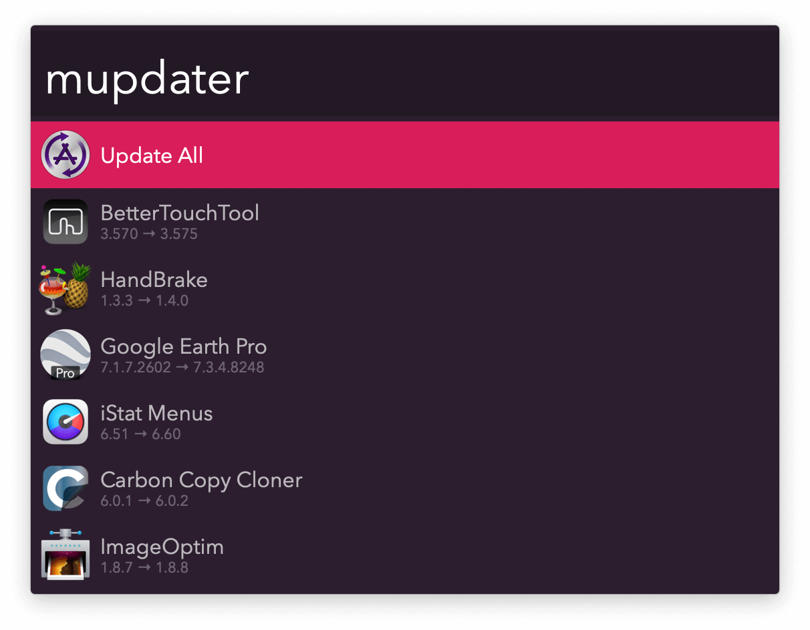

# MacUpdater Alfred Workflow

Official [MacUpdater](https://www.corecode.io/macupdater/) Alfred Workflow to keep your software effortlessly up-to-date.

Run the Keyword (default: `mupdater`) to see a list of outdated software. Press <kbd>⏎</kbd> to update.

## Requirements

* MacUpdater Pro or Business Edition.
* Alfred PowerPack (Alfred 4 or 5).

## Download (for Alfred 5)

[Install from the Alfred Gallery.](https://alfred.app/workflows/corecode/macupdater/)

## Download (for Alfred 4)

[Get the last compatible release.](https://github.com/core-code/MacUpdater-Alfred-Workflow/releases/download/2022.1/MacUpdater.alfredworkflow)

## License

2-Clause BSD License.
